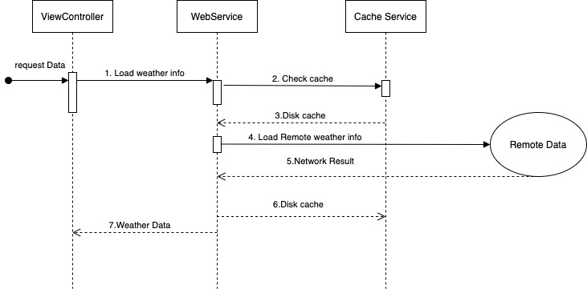

# WeatherSample

# 1. Software development principles, patterns & practices being applied
- Applied VIPER pattern to build the application on the Single Responsibility Principle
- This is not trickly VIPER architect which each module communicate through protocol. 
In this app those component directly talking with each others, View owns Presenter, Presenter owns Interactor and they talking through Observer by using Rxswift. 
- API serivces and cache services build base on Dependency Inversion principle.


# 2. Code folder structure and libraries and frameworks being used
## It have 3 main folders: 
- WeatherInfo: content source code
- WeatherInfoTests: Contains code for unit tests
- WeatherInfoUITests: Contains code for UI test

WeatherInfo: 
 Modules\WeatherForcast: 
 - Router
 - Presenter
 - Interactor
 - Entities
 - Views
 Utilites: 
 - Contains some helpler file for app
 Services: 
 - Contains Api service and cache services code.
 
 ### Structures:
 
 
 
 - Applied URLCache for caching API request.
 [HTTP Cacheing](https://developer.apple.com/documentation/foundation/nsurlrequestcachepolicy/nsurlrequestuseprotocolcachepolicy)
 
  
 
## Third party: 
- [RxSwift](https://github.com/ReactiveX/RxSwift) : ussed for passing data between boundary 
- [SDWebImage](https://github.com/SDWebImage/SDWebImage) : used for loading and cached image.


# 3. All the required steps in order to get the application run on local computer:


- Usded swift package for handle dependency.
- git clone https://github.com/hulanguyen/WeatherSample.git
- Open project and wait for it loading all package dependencies
- build and run the app with simulator.
- Deloyment target only support for iOS 13 and above
- App default loading weather of "saigon" when starting. 
- App default clear cach after 2 days. And this checking after launching app.
Note: current app development which using swift 5, xcode 13.

# 4. Checklist of items:

 1. Programming language: Swift -> Done.
 2. Design app's architecture VIPER -> Done.
 3. UI should be looks like in attachment. -> Done.
 4. Write UnitTests -> Done
 5. Acceptance Tests -> Done
 6. Exception handling -> Done
 7. Caching handling -> Done
 8. Accessibility for Disability Supports:
    ```
    a. VoiceOver: Use a screen reader. -> Done
    b. Scaling Text: Display size and font size -> Done
    ```


# 5. Sequence diagram: 

  
   

